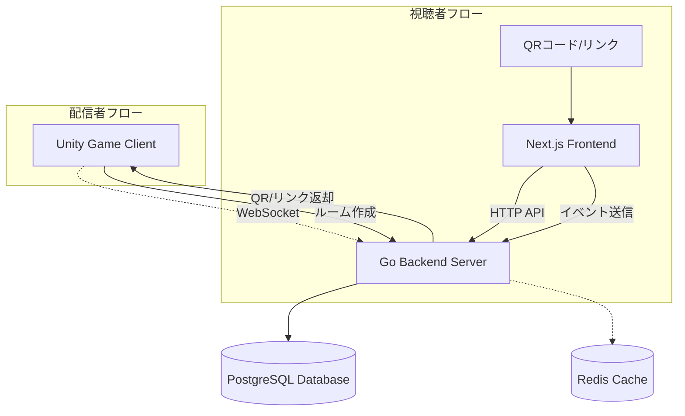

# 設計書

## 概要

配信者向け 2D アクションゲームシステムは、Unity（ゲーム）、Go（バックエンド）、Next.js（フロントエンド）の 3 つのコンポーネントで構成されます。視聴者が Web ページからイベントを発生させ、それがリアルタイムでゲームに反映される仕組みを提供します。

## アーキテクチャ



### 通信プロトコル

- **Unity ↔ Go**: WebSocket（双方向リアルタイム通信）
- **Next.js ↔ Go**: HTTP REST API（視聴者のイベント送信）
- **Go ↔ Database**: SQL 接続
- **Go ↔ Redis**: 将来的なキャッシュ層

## コンポーネントとインターフェース

### 1. Go バックエンドサーバ

#### 主要パッケージ構成

```
cmd/
  server/
    main.go
internal/
  handler/
    websocket.go
    api.go
  service/
    room.go
    event.go
    counter.go
  repository/
    room.go
    event.go
  model/
    room.go
    event.go
  config/
    config.go
pkg/
  counter/
    interface.go
    memory.go
    redis.go
```

#### WebSocket ハンドラー

```go
type WebSocketHandler struct {
    connections map[string]*websocket.Conn
    roomService *service.RoomService
}

// Unity接続管理
func (h *WebSocketHandler) HandleUnityConnection(w http.ResponseWriter, r *http.Request)
func (h *WebSocketHandler) SendEventToUnity(roomID string, event *model.GameEvent) error
```

#### HTTP API エンドポイント

```
GET  /api/rooms/{id}         # ルーム情報取得（視聴者ページ用）
POST /api/rooms/{id}/events  # イベント送信（視聴者→サーバ）
GET  /api/rooms/{id}/stats   # 統計情報取得（将来の管理画面用）
```

#### WebSocket メッセージ（Unity ↔ Go）

```json
// Unity → Go（ルーム作成）
{
  "type": "create_room",
  "streamer_id": "streamer123"
}

// Go → Unity（ルーム作成完了）
{
  "type": "room_created",
  "room_id": "abc123",
  "qr_code": "data:image/png;base64,...",
  "web_url": "https://example.com/room/abc123"
}

// Go → Unity（イベント発火時）
{
  "type": "game_event",
  "event_type": "help",
  "trigger_count": 5
}
```

### 2. Next.js フロントエンド

#### ページ構成

```
pages/
  room/
    [id].tsx          # 視聴者参加ページ
  api/
    health.ts         # ヘルスチェック
components/
  EventButton.tsx     # イベント発火ボタン
  RoomStatus.tsx      # ルーム状態表示
```

#### 主要コンポーネント

```typescript
interface EventButtonProps {
  roomId: string;
  eventType: "help" | "hinder";
  onEventSent: () => void;
}

const EventButton: React.FC<EventButtonProps> = ({
  roomId,
  eventType,
  onEventSent,
}) => {
  // イベント送信ロジック
};
```

### 3. イベント集約システム

#### カウンターインターフェース

```go
type Counter interface {
    Increment(roomID, eventType string) (int, error)
    GetCount(roomID, eventType string) (int, error)
    Reset(roomID, eventType string) error
}

type MemoryCounter struct {
    mu     sync.RWMutex
    counts map[string]int
}

type RedisCounter struct {
    client *redis.Client
}
```

## データモデル

### データベーススキーマ

#### rooms テーブル

```sql
CREATE TABLE rooms (
    id VARCHAR(36) PRIMARY KEY,
    streamer_id VARCHAR(255) NOT NULL,
    created_at TIMESTAMP DEFAULT CURRENT_TIMESTAMP,
    expires_at TIMESTAMP,
    status ENUM('active', 'inactive', 'expired') DEFAULT 'active',
    settings JSON
);
```

#### events テーブル

```sql
CREATE TABLE events (
    id BIGINT AUTO_INCREMENT PRIMARY KEY,
    room_id VARCHAR(36) NOT NULL,
    viewer_id VARCHAR(255),
    event_type ENUM('help', 'hinder') NOT NULL,
    triggered_at TIMESTAMP DEFAULT CURRENT_TIMESTAMP,
    metadata JSON,
    FOREIGN KEY (room_id) REFERENCES rooms(id)
);
```

#### game_events テーブル（Unity 送信イベント記録）

```sql
CREATE TABLE game_events (
    id BIGINT AUTO_INCREMENT PRIMARY KEY,
    room_id VARCHAR(36) NOT NULL,
    event_type ENUM('help', 'hinder') NOT NULL,
    trigger_count INT NOT NULL,
    sent_at TIMESTAMP DEFAULT CURRENT_TIMESTAMP,
    FOREIGN KEY (room_id) REFERENCES rooms(id)
);
```

### データモデル（Go 構造体）

```go
type Room struct {
    ID         string    `json:"id" db:"id"`
    StreamerID string    `json:"streamer_id" db:"streamer_id"`
    CreatedAt  time.Time `json:"created_at" db:"created_at"`
    ExpiresAt  *time.Time `json:"expires_at" db:"expires_at"`
    Status     string    `json:"status" db:"status"`
    Settings   string    `json:"settings" db:"settings"`
}

type Event struct {
    ID          int64     `json:"id" db:"id"`
    RoomID      string    `json:"room_id" db:"room_id"`
    ViewerID    *string   `json:"viewer_id" db:"viewer_id"`
    EventType   string    `json:"event_type" db:"event_type"`
    TriggeredAt time.Time `json:"triggered_at" db:"triggered_at"`
    Metadata    string    `json:"metadata" db:"metadata"`
}

type GameEvent struct {
    RoomID      string `json:"room_id"`
    EventType   string `json:"event_type"`
    TriggerCount int   `json:"trigger_count"`
}
```

## エラーハンドリング

### エラータイプ定義

```go
type ErrorType string

const (
    ErrRoomNotFound    ErrorType = "ROOM_NOT_FOUND"
    ErrRoomExpired     ErrorType = "ROOM_EXPIRED"
    ErrInvalidEvent    ErrorType = "INVALID_EVENT"
    ErrDatabaseError   ErrorType = "DATABASE_ERROR"
    ErrWebSocketError  ErrorType = "WEBSOCKET_ERROR"
)

type APIError struct {
    Type    ErrorType `json:"type"`
    Message string    `json:"message"`
    Code    int       `json:"code"`
}
```

### WebSocket 接続管理

```go
type ConnectionManager struct {
    connections map[string]*Connection
    mu          sync.RWMutex
}

type Connection struct {
    conn     *websocket.Conn
    roomID   string
    lastPing time.Time
}

func (cm *ConnectionManager) HandleDisconnection(roomID string) {
    // 再接続ロジック
    // ログ記録
    // クリーンアップ
}
```

## テスト戦略

### 単体テスト

- **サービス層**: ビジネスロジックのテスト
- **リポジトリ層**: データベース操作のテスト
- **ハンドラー層**: HTTP/WebSocket ハンドラーのテスト

### 統合テスト

- **API 統合テスト**: HTTP エンドポイントの動作確認
- **WebSocket 統合テスト**: リアルタイム通信の確認
- **データベース統合テスト**: データ整合性の確認

### テスト環境

```go
// テスト用のモックインターフェース
type MockCounter struct {
    counts map[string]int
}

func (m *MockCounter) Increment(roomID, eventType string) (int, error) {
    key := fmt.Sprintf("%s:%s", roomID, eventType)
    m.counts[key]++
    return m.counts[key], nil
}
```

### パフォーマンステスト

- **WebSocket 接続数**: 同時接続数の限界テスト
- **イベント処理**: 高頻度イベント送信時の性能
- **データベース負荷**: 大量データ書き込み時の性能

## セキュリティ考慮事項

### 認証・認可

- ルーム ID による簡易認証
- レート制限（視聴者あたりのイベント送信頻度）
- CORS 設定

### データ保護

- 個人情報の最小化（視聴者 ID は任意）
- SQL インジェクション対策
- XSS 対策（フロントエンド）

## 運用・監視

### ログ設計

```go
type LogEntry struct {
    Timestamp time.Time `json:"timestamp"`
    Level     string    `json:"level"`
    Component string    `json:"component"`
    RoomID    string    `json:"room_id,omitempty"`
    Message   string    `json:"message"`
    Error     string    `json:"error,omitempty"`
}
```

### メトリクス

- アクティブルーム数
- 同時接続数
- イベント処理レート
- エラー発生率

## 将来の拡張性

### Redis 移行計画

1. Counter インターフェースの実装追加
2. 設定による切り替え機能
3. データ移行ツール
4. パフォーマンス比較

### スケーリング対応

- 水平スケーリング（複数 Go サーバインスタンス）
- ロードバランサー対応
- データベース読み取りレプリカ
- CDN 活用（静的コンテンツ）
